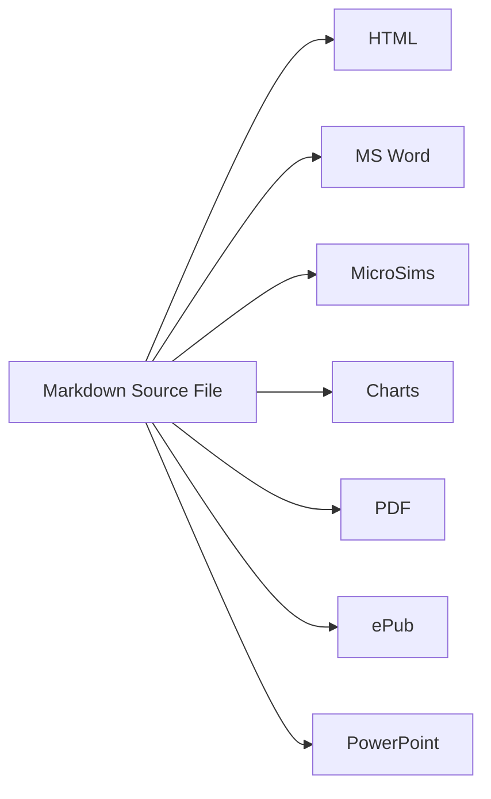
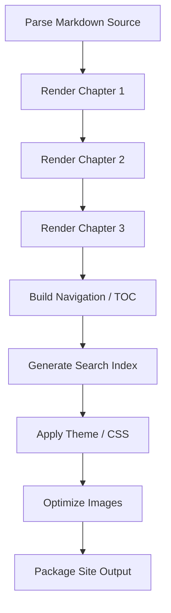
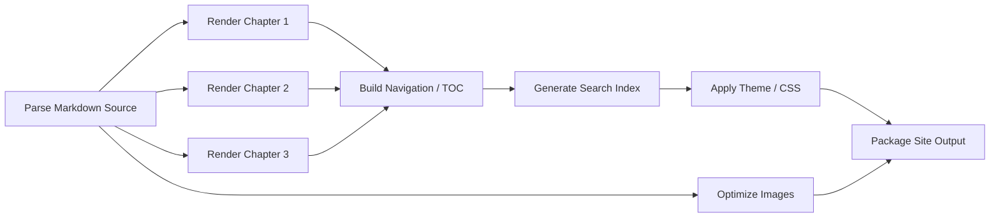

# Background on Web Publishing Tools

Before comparing MkDocs' plugin model to Zensical's ZRX engine in detail (see
[Why Zensical?](why-zensical.md)), it helps to see the two underlying
scheduling strategies — sequential and parallel — in isolation, and to see
where they came from historically.

## A Brief History, Interactively

The tools used to write and publish documentation evolved over roughly six
decades, from the earliest computerized formatters through Markdown, MkDocs,
and now Zensical. Explore that lineage in the timeline below.

<iframe src="sims/publishing-tools-timeline/main.html" height="882px" width="100%" scrolling="no"></iframe>

[Run the History of Documentation and Publishing Tools MicroSim Fullscreen](sims/publishing-tools-timeline/main.html){ .md-button .md-button--primary }

Filter the timeline to **Modern Doc-Site Generators** and **Rust & Zensical**
to see where MkDocs and Zensical each sit in that lineage. Full details on
this MicroSim are on its own page: [History of Documentation and Publishing
Tools](sims/publishing-tools-timeline/index.md).

## What Is Single-Source Publishing?

**Single-source publishing** means authoring content exactly once, in a
neutral format, and generating every output format a reader might need from
that one source — instead of hand-maintaining a separate copy of the content
for each format, which inevitably drift out of sync with each other. The
timeline above already shows an early version of this idea: DocBook's whole
reason for existing was separating a document's content from its
presentation so that one XML source could drive multiple outputs.

This book applies the same idea with Markdown as the single source. A
chapter written once in Markdown can be transformed into a browsable HTML
site, a Word document for an editor, an interactive MicroSim, a data chart,
a printable PDF, an ePub for e-readers, and a slide deck — all generated from
that one file, not five or six independently maintained ones:

The payoff is consistency: fix a typo or update a number once in the source,
and every downstream format picks up the fix on the next build. The cost is
that the conversion step for each output format has to be built and
maintained — which is exactly the kind of independent, parallelizable work
the rest of this page is about. Nothing about "HTML" depends on "PDF"
finishing first, so a build system with a real dependency graph can generate
all seven outputs at once instead of one at a time.

## How Many Cores Does a Publishing Machine Actually Have?

A parallel build scheduler is only as fast as the hardware underneath it. A
typical laptop or desktop sold today has somewhere between **8 and 16 CPU
cores**, and some publishing configurations have access to considerably
more:

| Machine | Typical CPU cores |
|---|---|
| Mac mini (M4, base) | 10 cores |
| Mac mini (M4 Pro) | 14 cores |
| MacBook Pro (M4 Pro / M4 Max) | 14-16 cores |
| Mac Studio (high-end configuration) | up to 32 cores |
| A Mac-based newsroom render/build cluster | as many as **36 cores** |

That last row matters for a documentation team, not just a broadcast one: a
publishing pipeline that can only ever run one task at a time gets no benefit
at all from those extra cores — they sit idle. A pipeline whose scheduler can
see which tasks are independent, on the other hand, gets faster in direct
proportion to how many cores are available, right up to the point where the
task graph itself runs out of independent work to hand out. That ceiling —
what the *graph's shape* allows, not what the hardware allows — is exactly
what the [ZRX Parallel Build Pipeline](sims/zrx-parallel-build-pipeline/index.md)
MicroSim later on this page lets you explore directly.

## Why So Many Older Tools Ran Sequentially

Modern build systems like Zensical's ZRX engine can run many independent
tasks at once because they model the build as a **dependency graph**: an
explicit record of which tasks need which other tasks' output before they
can start. Once that graph exists, a scheduler can safely start every task
whose dependencies are already satisfied and run them all at the same time.

Many older publishing tools never had that option, not because parallel
hardware didn't exist, but because **the tools were never designed around a
dependency graph in the first place**. MkDocs is a clear example: plugins run
in the fixed order they appear in `mkdocs.yml`, one after another, because
nothing in the architecture records what each plugin actually reads or
writes. With no declared inputs and outputs, there is nothing for a scheduler
to analyze — the only safe execution order the system can guarantee is the
literal order the human author typed into the config file. See [Why
Zensical?](why-zensical.md#where-the-old-model-broke-down) for the fuller
architectural explanation.

The result, across decades of publishing tools, was software that processed
one step, then the next, then the next — even on machines with plenty of
idle cores — simply because nothing in the tool ever asked the question
"which of these steps could safely happen at the same time?"

## Sequential vs. Parallel, Side by Side

The two diagrams below model the *same* small publishing pipeline — parse
source files, render each chapter, build navigation, then package the site —
under the two scheduling strategies described above.

### Sequential (Legacy) Scheduling

With no dependency graph, every step waits for the previous one to finish,
even when it has no real reason to. The pipeline is exactly as long as the
sum of every individual step:

### Parallel (Dependency-Graph) Scheduling

With a dependency graph, the scheduler can see that the three chapters don't
depend on each other — only on the shared parse step finishing first — so it
runs them together on separate cores. Navigation waits only for the
chapters; image optimization needs nothing but the parsed source and can run
the whole time:

The total work is identical in both diagrams — same eight tasks, same
dependencies. The only difference is whether the scheduler is allowed to
notice that Chapters 1-3 (and image optimization) don't need to wait on each
other. That single difference is the entire reason one pipeline finishes in
eight sequential steps and the other finishes in far fewer.

## Try It Yourself: The ZRX Parallel Build Pipeline MicroSim

The static diagrams above show *one* snapshot of each strategy. The MicroSim
below lets you step through both schedulers, task by task, and change the
number of available CPU cores to see how the parallel schedule's speed
depends on both the graph's shape and the hardware:

<iframe src="sims/zrx-parallel-build-pipeline/main.html" height="652px" width="100%" scrolling="no"></iframe>

[Run the ZRX Parallel Build Pipeline MicroSim Fullscreen](sims/zrx-parallel-build-pipeline/main.html){ .md-button .md-button--primary }

### How It Works

The MicroSim models an 11-task version of the same publishing pipeline shown
in the mermaid diagrams above, with a real dependency graph wired between
tasks. It supports two scheduling modes, selectable with a dropdown:

- **Parallel (ZRX)** — on each step, the scheduler scans every task that
  hasn't run yet, starts every one whose dependencies have already finished,
  and runs as many of them at once as the **CPU Cores** slider allows (1-16).
  This models ZRX, Zensical's Rust build engine.
- **Sequential (Legacy)** — tasks run one at a time, in a fixed listed order,
  the way MkDocs runs plugins, regardless of whether an earlier task's
  output is actually needed yet.

Click **Next Step** to advance the build one step at a time. Tasks currently
running turn gold, finished tasks turn green, and the **Cores This Step**
readout shows exactly how many of the available cores were actually put to
work — which, in Parallel mode, is capped by how many tasks the dependency
graph has *ready* at that moment, not by the slider. Try dragging the CPU
Cores slider down to 1 while in Parallel mode: the step count converges on
the Sequential baseline, because a dependency graph with only one core to
run it on can't do anything a fixed list couldn't already do. Full
walkthrough, lesson plan, and references are on the MicroSim's own page:
[ZRX Parallel Build Pipeline](sims/zrx-parallel-build-pipeline/index.md).
