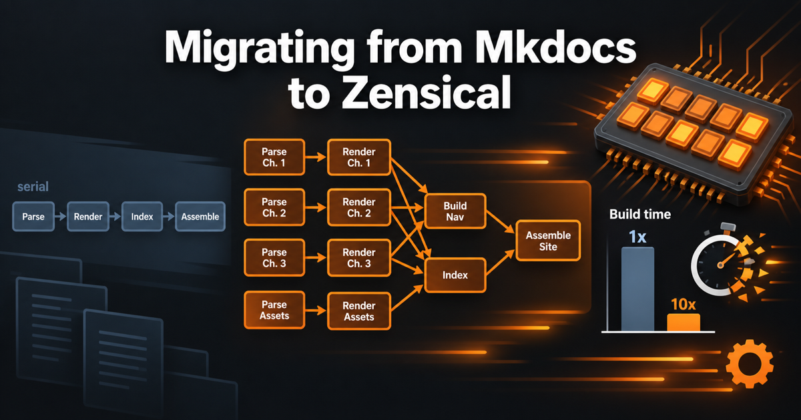

# Migrating from Mkdocs to Zensical

<figure markdown>
  { width="100%" }
</figure>

A guide to upgrading your book-building pipeline from MkDocs' single-threaded
Python build to Zensical, the Rust-based successor from the Material for
MkDocs team, and other Rust-enabled tools that let build steps run in
parallel across CPU cores.

## Getting Started

Use the navigation sidebar on the left to explore this guide.

- **About** — audience, prerequisites, and how to read this guide
- **Why Zensical?** — the case for switching your build pipeline
- **Migration Steps** — a step-by-step walkthrough for migrating your own book

## MicroSims

Interactive simulations live under [MicroSims](sims/index.md), including a
side-by-side look at the serial MkDocs pipeline versus the parallel Zensical
build.
