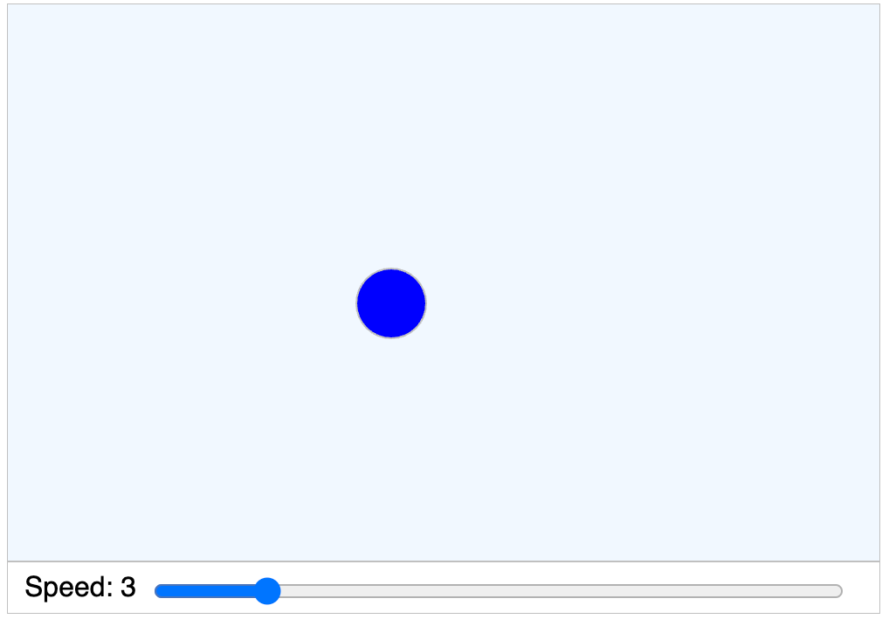
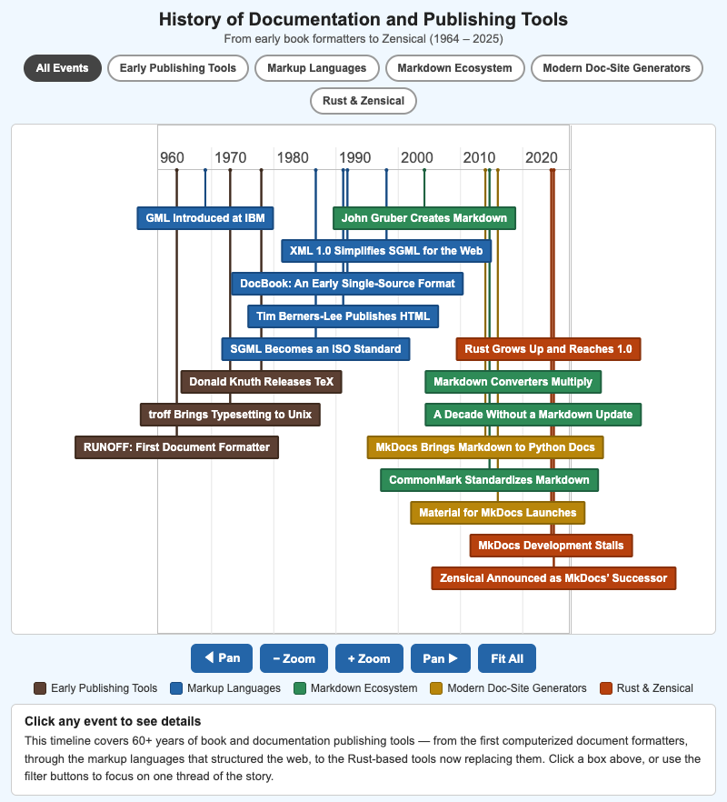
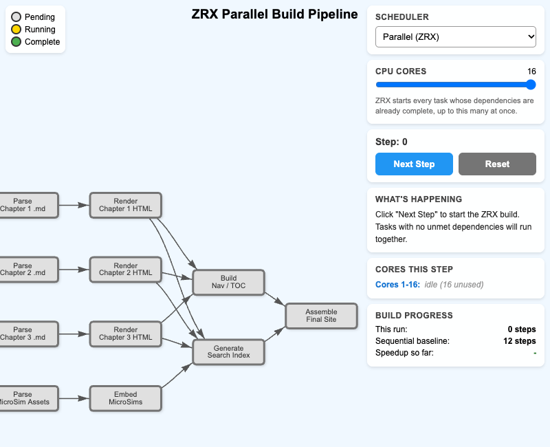

# List of MicroSims for Migrating from MkDocs to Zensical

Interactive Micro Simulations to help students learn migrating from mkdocs to zensical fundamentals.

-   **[Bouncing Ball](./bouncing-ball/index.md)**

    

    A MicroSim of a ball bouncing within the drawing region with a control for changing the speed.

-   **[History of Documentation and Publishing Tools](./publishing-tools-timeline/index.md)**

    

    Interactive vis-timeline MicroSim tracing 60+ years of book and documentation publishing tools, from early formatters through Markdown, MkDocs, Rust, and Zensical.

-   **[ZRX Parallel Build Pipeline](./zrx-parallel-build-pipeline/index.md)**

    

    Step through how Zensical's ZRX engine schedules a Markdown-to-HTML textbook build from a dependency graph, in parallel across CPU cores, versus a fixed one-task-at-a-time legacy order.

